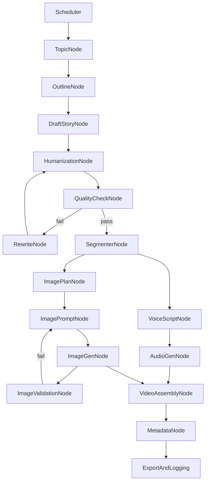

Perfeito. Vou **reformular o diagrama do LangGraph do zero**, já **ajustado à realidade correta** que fechamos:

* **vídeos longos (8–12 min)**
* **6–10 imagens geradas**
* **reuso inteligente**
* **humanização local**
* **loops automáticos**
* **sem intervenção humana**
* **pensado para custo baixo + escala**

Vou fazer em **3 partes**:

1. **Diagrama Mermaid**
2. **Explicação node a node (bem objetiva, mas profunda)**
3. **Onde ficam os loops e por quê**

---

# 1️⃣ Diagrama LangGraph (Mermaid)



---

# 2️⃣ Explicação DETALHADA de cada node

Vou ser extremamente claro sobre:

* **o que entra**
* **o que sai**
* **se usa LLM ou não**
* **por que esse node existe**

---

## 🕒 Scheduler

**Função:** disparar o pipeline

* Cron / Airflow / Prefect / APScheduler
* Apenas dispara o grafo com um `run_id`

**LLM:** ❌
**Por quê existe:** LangGraph não agenda sozinho

---

## 🧠 TopicNode

**Função:** escolher o tema base

Exemplos:

* “Relato encontrado em fórum abandonado”
* “História sobre uma casa onde ninguém entra duas vezes”

**Entrada:** nada ou seed
**Saída:** `topic`

**LLM:** ✅ (baixo custo)
**Obs:** pode usar lista fixa + random

---

## 🧱 OutlineNode

**Função:** criar a **estrutura da história**

Entrega algo como:

```
Hook
Ato 1
Ato 2
Clímax
Final ambíguo
```

**Entrada:** topic
**Saída:** outline estruturado

**LLM:** ✅
**Por quê:** estrutura narrativa ainda vale a pena delegar

---

## ✍️ DraftStoryNode

**Função:** gerar o texto bruto (1.300–1.500 palavras)

* Sem humanização
* Sem pausas
* Texto “limpo”

**Entrada:** outline
**Saída:** story_draft

**LLM:** ✅ (chamada principal)

---

## 🧬 HumanizationNode

**Função:** remover “cara de IA”

Faz localmente:

* quebra frases
* remove conectores formais
* adiciona hesitações
* varia parágrafos

**Entrada:** story_draft
**Saída:** humanized_story

**LLM:** ❌
**Por quê:** engenharia > IA aqui

---

## ✅ QualityCheckNode

**Função:** validar se o texto presta

Checks objetivos:

* duração (8–12 min)
* variação de frases
* 1ª pessoa
* final não explicativo
* ausência de padrões de IA

**Entrada:** humanized_story
**Saída:** pass / fail + feedback

**LLM:** ❌

---

## 🔁 RewriteNode

**Função:** corrigir problemas apontados

Exemplo:

* “história curta demais”
* “final muito explícito”

**Entrada:** story + feedback
**Saída:** nova versão

**LLM:** ✅ (prompt direcionado)

👉 **Loopa apenas aqui**, nunca volta pro tema.

---

## ✂️ SegmenterNode

**Função:** quebrar a história em blocos temporais

Exemplo:

```
Segmento 1: 0–40s
Segmento 2: 40–90s
...
```

Cada segmento contém:

* texto
* emoção dominante
* intensidade

**LLM:** ❌ (regra de tamanho)

---

## 🎙️ VoiceScriptNode

**Função:** preparar texto para TTS

Faz localmente:

* inserir pausas `[pause=0.6]`
* quebras de linha
* ritmo variável

**Entrada:** segmentos
**Saída:** script TTS

**LLM:** ❌

👉 Aqui **NÃO se cria conteúdo**, só formatação.

---

## 🗺️ ImagePlanNode

**Função:** decidir **quais imagens são necessárias**

Entrega algo como:

```
Imagem 1: casa à noite (segmentos 1–2)
Imagem 2: corredor escuro (segmentos 2–3)
...
```

**Entrada:** segmentos
**Saída:** image_plan (6–10 imagens)

**LLM:** ❌ ou ✅ (opcional)

---

## 🖼️ ImagePromptNode

**Função:** escrever prompts bons

* estilo consistente
* descrição reutilizável
* evita detalhes específicos demais

**Entrada:** image_plan
**Saída:** prompts

**LLM:** ✅ (prompt curto)

---

## 🎨 ImageGenNode

**Função:** gerar imagens

* Stable Diffusion / API barata
* baixa quantidade (6–10)

**Entrada:** prompts
**Saída:** imagens

**LLM:** ❌ (modelo de imagem)

---

## 🧪 ImageValidationNode

**Função:** checar se imagem serve

Checks simples:

* não branca
* não borrada
* contraste mínimo

**LLM:** ❌

👉 Se falhar → gera prompt de novo

---

## 🔊 AudioGenNode

**Função:** gerar narração

* TTS local (Coqui, Piper, etc)
* pitch/speed com ruído controlado

**Entrada:** voice_script
**Saída:** áudio final

**LLM:** ❌

---

## 🎬 VideoAssemblyNode

**Função:** montar o vídeo

* reutiliza imagens
* aplica zoom/pan
* sincroniza com áudio
* adiciona música ambiente

Tudo via **ffmpeg**

**Entrada:** áudio + imagens
**Saída:** vídeo.mp4

**LLM:** ❌

---

## 🏷️ MetadataNode

**Função:** gerar título, descrição e tags

* título intrigante
* descrição curta
* SEO básico

**LLM:** ✅ (barato)

---

## 📦 ExportAndLogging

**Função:** finalizar

* salva vídeo
* salva metadados
* registra:

  * tokens
  * custo
  * duração
  * seed
  * sucesso/falha

**LLM:** ❌

---

# 3️⃣ Onde ficam os loops (importantíssimo)

| Node            | Loopa para   | Por quê      |
| --------------- | ------------ | ------------ |
| QualityCheck    | Rewrite      | conteúdo     |
| ImageValidation | ImagePrompt  | visual       |
| Rewrite         | Humanization | consistência |

👉 **Nunca volta pro Topic**, evita drift.

---

# 🔚 Conclusão direta

Esse grafo:

* é **viável**
* é **barato**
* é **automatizável**
* escala
* evita detecção fácil de IA
* funciona melhor em vídeo longo

Se você quiser, no próximo passo posso:

* transformar isso em **código LangGraph real**
* ou desenhar o **State dataclass**
* ou entrar no **ffmpeg detalhado**

👉 Qual desses você quer agora?
